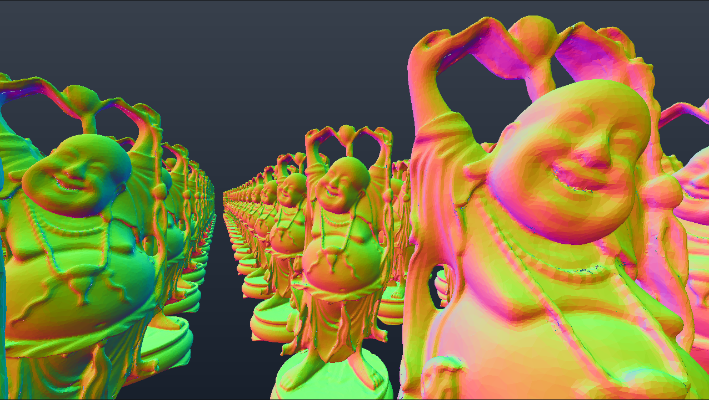

# bajo
bajo = low (... level) = batch mojo

Bajo is a work-in-progress, pure-Mojo simulation engine designed for Reinforcement Learning (RL) environments, spatial computing, and physics simulations. The end goal is to run thousands of environments concurrently with high throughput on a single GPU, similar to frameworks like [NVIDIA Warp](https://github.com/NVIDIA/warp) and the [Madrona Engine](https://madrona-engine.github.io/).

Because Mojo is still relatively new, I am currently building out the foundational GPU primitives required for physics simulations from scratch.


## Pixi tasks

Common commands:

```bash
pixi run download_assets   # download example/benchmark assets
pixi run install_prek      # install pre-commit hooks
pixi run test              # run tests
```

Benchmarks:
```
pixi run bench_quat
pixi run bench_aabb
pixi run bench_obj
pixi run bench_gpu_sort
pixi run bench_bvh_cpu
pixi run bench_bvh_gpu
pixi run bench_all
```
**bench_all** runs all individual benchmark tasks sequentially.

Examples:
```
pixi run example_lbvh
```
Runs the GPU LBVH normal-rendering example. It should produce the following image


## Roadmap
for a detailed version see [roadmap](roadmap.md)

Legend
- ✅ Done and tested
- 🚧 In progress / partially working
- ⬜ Planned

1. 🚧 Math primitives (80%)
2. 🚧 Pure-Mojo `.obj` / `.mtl` parser (90%)
3. 🚧 GPU sort  (80%)
4. 🚧 Gpu BVH  (70%)
5. ⬜ GPU Hash Grid
6. ⬜ Particle Simulation
7. ⬜ SPH Fluid Simulation
8. ⬜ Mesh / Particle Coupling
9. ⬜ Rigid Body Simulation
10. ⬜ Batched Simulation Environments

## Literature & References
see [sources](sources.md)
