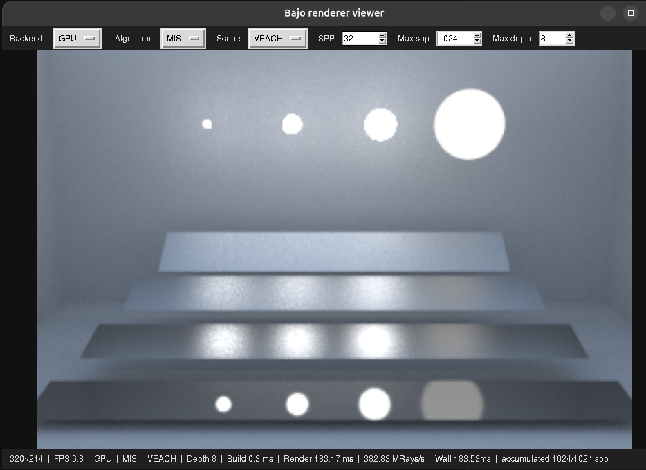

# bajo

`bajo = low (...) level = batch mojo`

Bajo is a work-in-progress, pure-Mojo engine for high-throughput geometry and rendering workloads. The long-term goal is to support many concurrent reinforcement-learning, spatial-computing, and physics environments on a GPU.

The current implementation is focused on the foundations needed for that goal: math and geometry primitives, OBJ/MTL and PBRT scene loading, CPU and GPU BVHs, GPU sorting, and CPU/GPU path tracing. Particle simulation, fluids, rigid bodies, and batched environments are planned work. See the detailed [roadmap](roadmap.md) for the current status of individual components.

## Requirements

- Linux x86-64
- [Pixi](https://pixi.sh/)
- A supported accelerator for GPU tests, GPU examples, and GPU benchmarks

Pixi provides the pinned nightly Mojo, MAX, and Python dependencies declared in
[`pixi.toml`](pixi.toml):

```bash
pixi install
```

Examples and asset-dependent benchmarks download their meshes on first use:

```bash
pixi run download_assets
```


## Interactive renderer

Launch the CPU viewer with its default RTIAW scene:

```bash
pixi run viewer
```



The viewer supports CPU and GPU backends, the `PATH`, `NEE`, `MIS`, `NORMALS`,
and `AO` algorithms, linear progressive accumulation, independent, Halton, R2,
Owen-Sobol, SZ, and procedural STBN sample sequences, Cornell/Veach/RTIAW scenes,
an emissive triangle-instance showcase, the built-in PBRT showcase, and custom
PBRT files.

Useful command-line options:


Use `W/S`, `A/D`, and `Q/E` to move; drag with the left mouse button to look
around. `R` resets the camera, `B` toggles CPU/GPU, `1`–`5` select an algorithm,
`+`/`-` adjust the number of progressive batches, and `Esc` closes the viewer.
One batch renders all `max-spp` samples in one pass; larger values divide that
same sample sequence across multiple updates. The status bar reports build time,
render time, FPS, and MRays/s.

The built-in stress scenes isolate different renderer limits:

| Scene | Contents | What to compare |
| --- | --- | --- |
| `MANY LIGHTS` | 528 spheres and 96 small colored emitters | PATH struggles to discover emitters; compare NEE/MIS and sampler convergence |
| `INDIRECT HALL` | Alternating diffuse baffles hiding four area lights | NEE only solves visible direct lighting; deep indirect transport remains noisy |
| `SPECULAR TRANSPORT` | Hollow glass shells, glossy reflectors, blockers, and tiny lights | Exposes caustics, fireflies, missing shadow transmission, and difficult delta paths |

For a GPU target other than the default, pass `--gpu-arch` or set
`BAJO_GPU_ARCH`.


## Tests

Run the host-only test suites without an accelerator:

```bash
pixi run test_host
```

Run GPU tests, or all tests:

```bash
pixi run test_gpu
pixi run test
```

The test runner accepts a suite path when a smaller test run is useful, for
example `pixi run test core` or `pixi run test bvh/cpu`.

## Examples

The main examples are available as Pixi tasks:

```bash
pixi run example_rtiaw        # small path-tracing example
pixi run example_cornell      # Cornell box: PATH, NEE, and MIS
pixi run example_mis_showcase  # compare PATH, NEE, and MIS
pixi run example_pbrt         # render the checked-in PBRT scene
pixi run example_lbvh         # CPU/GPU instanced OBJ normal render
```

Most examples write a PPM image in the repository root. The LBVH example needs
the downloaded OBJ assets and produces CPU and GPU outputs. The source files in
[`examples/`](examples/) are also intended to be runnable and easy to modify.

## Benchmarks

Common benchmark tasks include:

```bash
pixi run bench_all
pixi run bench_bvh
pixi run bench_bvh_cpu_report
pixi run bench_bvh_gpu_nexus_compare
pixi run bench_rt_cpu
pixi run bench_rt_gpu
pixi run bench_rt_cpu_gpu
pixi run bench_sort_mojo
```

GPU benchmarks require a supported accelerator. The CPU comparison report also
uses Embree 4 and TinyBVH; the Embree task requires Embree 4 headers and
`libembree4`. Recorded results are available in
[`bench/results/`](bench/results/), including the [CPU BVH report](bench/results/bvh_cpu/bvh_cpu.md)
and [CPU/GPU ray-tracing comparison](bench/results/rt_cpu_gpu/comparison.md).
The NexusBVH comparison writes its [result table](bench/results/bvh_gpu_nexus/comparison.md).

## Repository layout

- [`bajo/core`](bajo/core/) — vectors, matrices, quaternions, transforms, rays, and intersections
- [`bajo/parser`](bajo/parser/) — pure-Mojo OBJ/MTL/prt loading
- [`bajo/bvh`](bajo/bvh/) — CPU/GPU BVH construction and traversal
- [`bajo/rt`](bajo/rt/) — CPU and GPU ray-tracing and shading pipelines
- [`bajo/sort`](bajo/sort/) — CPU and GPU sorting implementations
- [`test`](test/) — Mojo tests grouped by subsystem
- [`bench`](bench/) — performance and diagnostic benchmarks

All repeatable commands and dependencies are defined in [`pixi.toml`](pixi.toml).

## References

See [`sources.md`](sources.md) for the papers and other references used by the
project.
